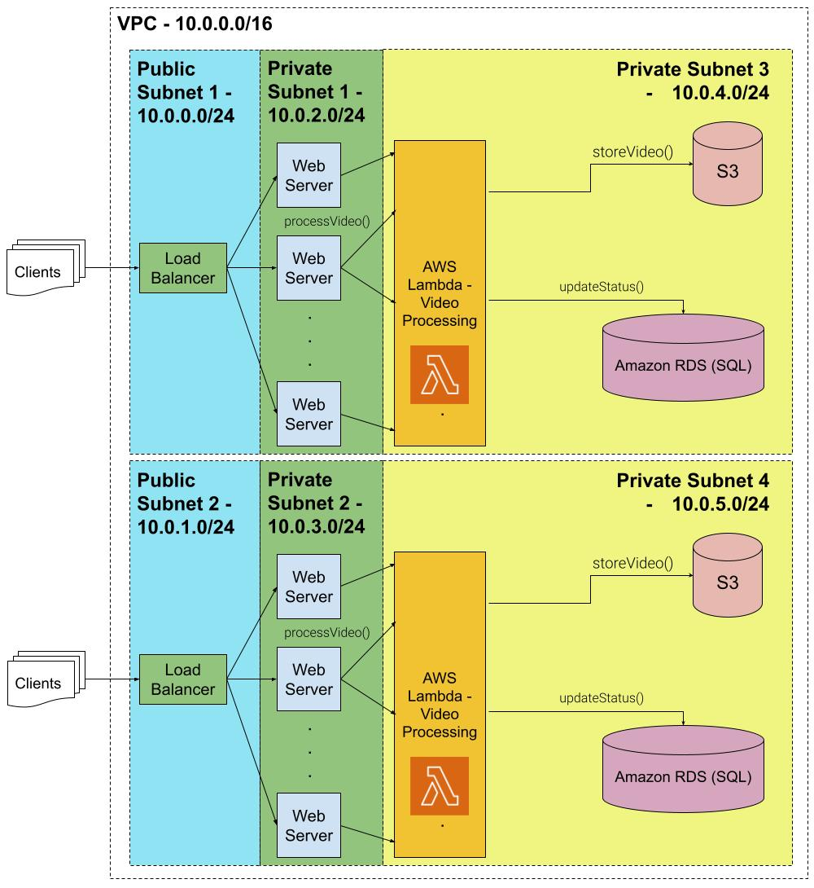

# Video meme-generator with AWS CloudFormation

The project contains detailed instructions for setup and deployment in this article:
[Tutorial: Video meme-generating application on EC2, AWS Lambda, AWS RDS, and S3 using AWS CloudFormation](https://www.notion.so/nikita-kotsehub/Tutorial-Video-meme-generating-application-on-EC2-AWS-Lambda-AWS-RDS-and-S3-using-AWS-CloudForma-6e184b9318114ceba3e0eba33be8efbd)

In the article, I provided instructions for creating all of the resources presented in the diagram you'll see in the article and below.
However, the actual working application that generates videos is self-contained in Part 6: S3 Bucket & AWS Lambda, 
which I recommend you try deploying. I also put this part into a standalone article here:
[Video meme-generating function with AWS Lambda & S3 using moviepy and ffmpeg](https://www.notion.so/nikita-kotsehub/Video-meme-generating-function-with-AWS-Lambda-S3-using-moviepy-and-ffmpeg-Part-6-of-Generating-ea91dd9823ff47fdb10cd982f1478de6)

